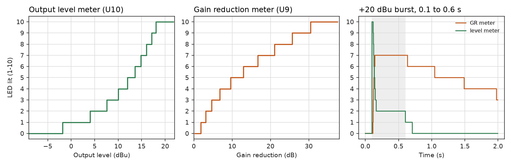

# Simulating the compressor

The seven-sheet schematic in `kicad/` simulates in KiCad's own simulator (ngspice). Every part
has a SPICE model, and the root sheet carries a small test bench: the rack's ±16 V, a balanced
1 kHz source, a 20 k balanced load, and one line of knob settings.

## Running it in KiCad

1. Open `kicad/UTS Mini Mixing Desk - Compressor.kicad_pro` in KiCad 10 (the sheets are saved in its format).
2. **Inspect → Simulator**, then **New Analysis Tab** and pick **Transient**. Something like
   step `10u`, stop `0.6` and max step `20u` works (in a `.tran` line: `.tran 10u 0.6 0 20u`).
   For the frequency response, pick **AC** instead, decade sweep from 10 Hz to 100 kHz.
3. Run it, then probe nets in the schematic. The useful ones:

| Net | What it shows |
|---|---|
| `OUT_DIFF` | The balanced output, OUT+ minus OUT- (a test-bench probe) |
| `OUT-A` | The makeup amp's output, the hot leg before the build-out resistor |
| `CTRL-B` | The control voltage: 0 V at rest, going negative as it compresses |
| `STB`, `STA` | The steering pair. STB minus STA is what sets the gain |
| `TIMING` | The attack/release capacitor C15 |
| `SIG-VCA` | After the gain cell and recovery amp |

The AC source is 1 V differential, so an AC run reads gain directly.

## Changing the settings

The knobs are `.param` lines in the text block at the bottom of the root sheet. Edit the text
and run again.

| Param | Part | 0 means | 1 means |
|---|---|---|---|
| `LEVEL_DBU` | source | input level in dBu, differential | |
| `FREQ` | source | tone frequency in Hz | |
| `THRESHOLD` | RV3 | 0 Ω: lowest threshold, about −20 dBu | 100 kΩ (audio taper): about +20 dBu |
| `RATIO` | RV4 | wiper at the rectifier: hardest | wiper at ground: no compression |
| `ATTACK` | RV5 | 0 Ω: fastest | 10 k: slowest |
| `RELEASE` | RV6 | 0 Ω: fastest | 1 M: slowest |
| `MAKEUP` | RV2 | 0 dB | +21 dB |
| `TRIM` | RV1 | unity trim | |
| `GRTRIM`, `LVLTRIM` | RV7, RV8 | meter trims | |
| `BYPASS`, `KEY` | SW1, SW2 | in, internal key | bypassed, external key |
| `HPF_DEFEAT`, `LINK` | SW3, SW4 | sidechain HPF in, link open | HPF shorted out, link closed |

Pot positions are where the wiper sits between pin 1 (0) and pin 3 (1), so they are not
necessarily the knob's clockwise direction. RATIO is the exception: RV4 is wired with its
outer pins swapped, so its model reads `POS={1-RATIO}` and `RATIO` keeps the meaning in the
table. See the note on pot direction in the results.

## The models

All in `compressor_models.lib`, which says where each one comes from:

- **BC549C**: Philips' model.
- **1N4148, 1N4004**: vendor models. **BZX79C5V1** and the **LEDs**: generic models.
- **NE5532**: a behavioural model written for this design. TI's 1989 macromodel was tried
  first, but ngspice aborts on its output current limiter when the meter's peak detector
  swings. The behavioural one has the real part's gain, bandwidth, slew rate, input bias,
  swing and current limit, but no noise and no distortion of its own until it clips.
- **LM3914N** (both meter drivers): a behavioural model written for this design. It has the
  1.25 V reference, the ten-step divider, ten comparators, dot or bar mode from pin 9, and LED
  outputs that sink 10 times the current drawn from REFOUT. That current includes the
  internal divider's, which may read a little high against a real part. No hysteresis or
  comparator offsets.
- **Pots and switches**: ideal, set by the parameters above. A pot whose value ends in A
  (RV3, 100kA) has an audio taper: 10% of its resistance at half travel.

`tools/add_sim_models.py` writes the `Sim.*` fields onto the sheets. Run it again if the
sheets are regenerated, or if you add a part that needs a model. The `.options rshunt=1e9`
line on the bench matters: without it ngspice stalls once the compressor is working hard.

## Running it without the KiCad GUI

`tools/sim/` has the scripts that produced the results below. They export the netlist with
`kicad-cli sch export netlist --format spice` and run ngspice in batch mode:

```
python3 tools/sim/run_all.py      # needs kicad-cli, ngspice, numpy, matplotlib
python3 tools/sim/meters.py       # the two LED meters, about 10 minutes
```

## Results

Run on 2 October 2026 with kicad-cli 10.0.6 and ngspice 42, from the sheets as they are on this
branch. Levels are balanced (differential) dBu, at 1 kHz, makeup at 0, attack and release at
half travel unless it says otherwise. `results/results.json` has every number.


**It works as a compressor, and now meets most of its design targets.** The first simulation
(1 October, values as they were on `main`) found the module had 6 dB of gain, an early bass
roll-off, a threshold that did all its work in the first quarter of RV3, and attack and release
much faster than the RC values suggest. Fourteen part values changed to fix that; no connections
moved, so the board layouts keep their routing.

| Part | Was | Now | Why |
|---|---|---|---|
| R21, R22 | 3k3 | 6k8 | Halves the recovery amp's gain: the module is unity and BYPASS matches |
| C9, C10 | 2u2 | 4u7 | With the larger R21/R22, the bass corner drops from 22 Hz to about 5 Hz |
| R36 | 100k | 82k | With R35 and RV3, sets the detector gain range |
| RV3 | 1M linear | 100kA | Spreads the threshold evenly over the knob; RK09K stops at 100k |
| R35 | 20k | 1k | Sets the lowest threshold at −20 dBu |
| R38, C14 | 10k, 220n | 1k, 2u2 | Holds the sidechain high-pass between 80 and 160 Hz over the threshold knob; with R38 at 10k the small R35 pushed it to 400 Hz at low thresholds |
| R60 | 47k | 24k | Restores the 150 mV resting steer (VREF5 now 5.77 V, close to the 5.49 V on the power page) |
| C22 | 47u | 4u7 | Stops the steering overshooting by up to 20 dB on a fast attack (below) |
| R47 | 4k7 | 15k | Fastest release near 47 ms; the release pot loads the detector less |
| RV5 | 4k7 | 10k | Altronics' 9 mm pots come in 10k, 100k and 1M only |
| RV6 | 220k | 1M | Same; slows the slowest release past the 2.2 s target |

| | Before | Now | Target |
|---|---|---|---|
| Gain at 1 kHz, balanced in to out | +5.8 dB | −0.1 dB | 0 dB |
| RV1 trim range | +4.9 to +6.8 dB | +0.9 to −1.0 dB | covers 0 dB |
| −3 dB points | 22 Hz, 60 kHz | 5.6 Hz, 60 kHz | 20 Hz to 20 kHz |
| Threshold (1 dB of reduction) | −9 to above +20 dBu | −21 to +19 dBu | −20 to +14 dBu |
| Threshold at RV3 0, ¼, ½, ¾, 1 | −9, +14, above +20 by ½ | −21, −10, 0, +10, +19 | an even spread |
| Most reduction (+22 dBu in) | 22 dB | 36 dB | about 40 dB |
| Attack, fastest to slowest | 1 to 14 ms | 2 to 71 ms | 2.7 to 50 ms |
| Release, fastest to slowest | 20 ms to 0.44 s | 49 ms to 3.5 s | 47 ms to 2.2 s |
| Resting steer, VREF5 | 94 mV, 3.60 V | 150 mV, 5.75 V | 150 mV, 5.49 V |
| CTRL-B at most reduction | −4.5 V | −8.0 V | −10 V |
| Supply at rest, +16 / −16 V | 72 / 61 mA | 72 / 62 mA | about 60 mA |

Distortion stays low while it compresses, which is the whole point of the steering cell:

| Condition | Out | Gain reduction | THD |
|---|---|---|---|
| +4 dBu in, not compressing | +3.9 dBu | 0 | 0.008% |
| +4 dBu in, makeup at full | +24.7 dBu | 0 | 0.010% |
| +8 dBu in, threshold at ¼ | −5.9 dBu | 13.8 dB | 0.013% |
| +8 dBu in, threshold lowest | −15.5 dBu | 23.3 dB | 0.026% |
| +16 dBu in, threshold lowest | −14.7 dBu | 30.5 dB | 0.031% |
| +16 / +20 / +22 dBu in, not compressing | | 0 | 0.033% / 0.057% / 0.079% |
| +24 dBu in, not compressing | | 0 | 6.2%, the input stage clipping |

The op amp model has no distortion of its own below clipping, so these figures are the gain
cell's. Real NE5532s add a little.

### The meters

Run on 3 October 2026 by `tools/sim/meters.py`, with the LM3914 model above and ten LEDs per
meter. `results/meters.json` has the numbers.

- **Level (U10).** RV8 set so the top LED lights at +18 dBu out: that needs RV8 at 0.22 of its
  travel (R92 is 4k7, so the reference is 3.43 V). Steps are even in volts, so they close up
  towards the top.
- **Gain reduction (U9).** RV7 at 0.556 puts the top LED at about 30 dB. The R93 offset and
  the gain cell's curve spread the steps out from 2 dB to 30 dB.
- **Each lit LED draws 9.6 mA** on the level meter. The GR meter's reference also feeds R93,
  so by the same rule its LEDs run a little brighter, about 12 mA.

| LED | Level meter | lights at | GR meter | lights at |
|---|---|---|---|---|
| 1 | D30 | -1.8 dBu | D20 | 1.8 dB |
| 2 | D31 | +4.1 dBu | D21 | 3.1 dB |
| 3 | D32 | +7.5 dBu | D22 | 4.7 dB |
| 4 | D33 | +10.1 dBu | D23 | 6.8 dB |
| 5 | D34 | +12.0 dBu | D24 | 9.6 dB |
| 6 | D35 | +13.6 dBu | D25 | 12.9 dB |
| 7 | D36 | +14.8 dBu | D26 | 16.7 dB |
| 8 | D37 | +16.0 dBu | D27 | 21.1 dB |
| 9 | D38 | +17.1 dBu | D28 | 25.7 dB |
| 10 | D39 | +18.0 dBu | D29 | 30.4 dB |

On a +20 dBu burst with the threshold at half travel, the level meter hits its top LED for
the first 15 ms or so, until the attack catches up, then drops to LED 2 as the output settles
near +5 dBu. The GR meter climbs
to LED 7 (about 17 to 21 dB) and falls back over the release.



### What still misses

1. **Most gain reduction is 36 dB, not 40 dB.** The input stage clips at about +23 dBu on
   ±16 V, so 40 dB would need a threshold near −30 dBu. Better to restate the target.
2. **The slowest attack is 71 ms and the slowest release 3.5 s**, against 50 ms and 2.2 s.
   RV5 and RV6 are the nearest values Altronics stocks (10k and 1M); a 4k7 and a 500k from
   elsewhere give 34 ms and 1.8 s. Both ranges still cover the targets at their fast ends.
3. **Times depend on level.** They are the time to 63% of the change in gain for a −10 to
   +20 dBu burst at half threshold (about 0 dBu), so about 20 dB over. Harder hits are faster.
4. **The ratio rises with level.** With RATIO at the hard end the knee is soft: about 4:1 just
   above the threshold, steeper (6:1 to 11:1) by 20 dB over.
5. **CTRL-B reaches −8.0 V at the most reduction, not −10 V.** Set the gain-reduction meter's
   RV7 against a measured CTRL-B.
6. **Supply current is about 72 / 62 mA at rest** (README says about 60 mA). That includes
   6 mA for each LM3914. A lit meter LED adds about 10 to 12 mA on +16 V (see the meters
   below), so with one LED lit in each meter +16 V is about 94 mA, inside the rack's 130 mA.
7. **C22 (fixed).** C22 filters the reference for STA only. When CTRL-B pulled the shared
   reference node down, STA lagged STB by about 60 ms, so the gain kept falling after the
   control voltage had settled: up to 20 dB of overshoot on a fast attack. At 4u7 it is about
   1 dB.


### To check by hand before ordering

- **Pot direction.** On the usual convention pin 3 is the clockwise end of a pot. RV4's
  outer pins are swapped on the sheets and the front board, so if that holds for the RK09K,
  RATIO turns clockwise for a harder ratio. THRESHOLD is still wired the other way from the
  site's guide: clockwise raises the threshold. Swapping RV3 too would need a reverse-log (C)
  taper. MAKEUP, ATTACK and RELEASE turn the expected way.
- **Parts.** `bom/altronics.csv` lists every part, with the film capacitors and the 0.1%
  R61/R62 from element14.
