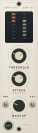

# Front panel — OPN-500 / CMP-01

Faceplate mockup and machining data for the compressor module.



| File | What it is |
|---|---|
| `faceplate-mockup.svg` | How it looks — whichever finish you built last. |
| `faceplate-mockup-bone.svg` | The other finish, written every run so you can compare. |
| `faceplate-drawing.svg` | 1:1 technical drawing, dimensioned, for checking before you cut. |
| `faceplate.dxf` | Outline and holes only, for a panel shop or CNC. |
| `make_panel.py` | Generates all of it from one definition. |

Everything comes out of `make_panel.py`, so the picture and the machining data cannot drift
apart. Change a control position once and re-run:

```bash
python3 make_panel.py                          # pull layout, anodised (default)
python3 make_panel.py --layout toggle          # five knobs, four flanking toggles
python3 make_panel.py --layout concentric      # concentric knobs, button, toggles
python3 make_panel.py --style bone             # light flat-graphic finish
python3 make_panel.py --layout toggle --style bone
```

## Layouts

The layout changes **what hardware is on the panel**, so the hole pattern, the drawing and the
DXF all change with it.

**`pull`** *(default)* — five separate knobs. Every switch function is a pull on a pot, so
there are no toggles and no button at all: THRESHOLD pulls for the sidechain HPF, RATIO for
key int/ext, MAKEUP for bypass. LINK is an internal jumper. **21 holes.** The simplest panel
to build and the cheapest to populate, at the cost of a slow, uncertain bypass action.

*A note on the shared row:* ATTACK and RELEASE sit side by side on every layout, so they get a
smaller legend and no printed numerals — two full scales would print their endpoints on top of
each other in the gap between the knobs.

**`toggle`** — the same five knobs, but every switch gets its own toggle rather than hiding on
a pull. They flank the two knobs they belong to: HPF and KEY either side of THRESHOLD, LINK and
BYPASS either side of RATIO. **25 holes.** Four more holes and four more parts than `pull`, and
in exchange every function is one positive movement — nothing is hidden, and bypass is instant.
The most parts of the three layouts, and the easiest to use.

**`concentric`** — two dual-concentric knobs (THRESHOLD/RATIO, ATTACK/RELEASE) free the space
for a latching illuminated BYPASS button and HPF / KEY toggles; LINK moves to the pull on
MAKEUP. **22 holes.** Better ergonomics, but concentric pots are dearer, harder to source, and
their inner shafts cannot carry a printed scale.

## Finishes

**`anodised`** *(default)* — dark panel, knurled knobs, teal accents. Reads as studio hardware.
The recessed meter window and the DYNAMICS / OUTPUT section rules appear on the concentric
layout only; the pull layout is plainer because it has no room for them.

**`bone`** — light panel, flat graphic treatment, printed dot scales with 0–10 numerals, thin
metal bat toggles, sage and terracotta. Closer to a plugin UI than a rack unit.

Every run writes the chosen combination as `faceplate-mockup.svg` and the other finish as
`faceplate-mockup-<name>.svg`, so comparing costs nothing.

## Panel dimensions

From the API 500 mechanical specification, not guessed:

| | Imperial | Metric |
|---|---|---|
| Width | 1.500″ | 38.10 mm |
| Height | 5.250″ | 133.35 mm |
| Thickness | 0.125″ | 3.18 mm |
| Mounting hole pitch | 4.938″ | 125.43 mm |
| Mounting hole Ø | 0.125″ | 3.18 mm |
| Countersink | 82° to 0.225″ | 82° to 5.72 mm |

Both mounting holes sit on the vertical centreline at x = 19.05 mm, which puts them
3.96 mm from each end.

## Drill schedule

Origin is the **top-left corner** of the panel, x right, y down. All in millimetres.

| Ref | Function | X (mm) | Y (mm) | Hole Ø | Hardware |
|---|---|---|---|---|---|
| `RV3` / `RV4` | THRESHOLD (outer) + RATIO (inner) | 19.05 | 56.00 | 9.5 | dual-concentric pot, 3/8″ bushing |
| `RV5` / `RV6` | ATTACK (outer) + RELEASE (inner) | 19.05 | 79.00 | 9.5 | dual-concentric pot, 3/8″ bushing |
| `RV2` | MAKEUP + pull link | 19.05 | 105.00 | 7.0 | 9 mm pull-switch pot |
| `SW1` | BYPASS | 9.50 | 122.00 | 8.0 | latching pushbutton, illuminated |
| `SW3` | HPF | 6.00 | 105.00 | 6.0 | mini toggle |
| `SW2` | KEY | 32.00 | 105.00 | 6.0 | mini toggle |
| `D201`–`D207` | GR meter, 7 seg | 13.60 | 14.0 to 35.0, 3.5 pitch | 2.2 | 2 mm LED |
| `D301`–`D307` | LVL meter, 7 seg | 24.50 | 14.0 to 35.0, 3.5 pitch | 2.2 | 2 mm LED |
| — | mounting | 19.05 | 3.96 | 3.18 | c'sink 82° to Ø5.72 |
| — | mounting | 19.05 | 129.39 | 3.18 | c'sink 82° to Ø5.72 |

## Layout notes

**Dual-concentric knobs carry the four paired controls.** THRESHOLD over RATIO, ATTACK over
RELEASE — the outer ring is dark and knurled, the inner cap amber, so which one you have hold
of is obvious. This is what buys the room for two meters, a button and two toggles on a
38 mm panel; four separate knobs would eat 40 mm of height on their own.

The trade is cost and sourcing: dual-concentric pots are dearer and harder to find than two
singles, and you generally **cannot get a pull switch on one**, which is why the switch
functions live elsewhere.

**Control map**

| Position | Outer / primary | Inner / secondary |
|---|---|---|
| Upper concentric | THRESHOLD | RATIO |
| Lower concentric | ATTACK | RELEASE |
| Single knob | MAKEUP | pull for LINK |
| Button | BYPASS (latching, lit) | — |
| Toggles | HPF, KEY | — |

**`BYPASS` is a latching pushbutton** legended on its own face. The bottom screw owns the
centreline down there and there is no room for a legend beside it; putting the word on the cap
is what a real panel does anyway. It is illuminated, so bypass state is visible across a room.

**`LINK` is a pull on MAKEUP.** It is set once per stereo pair and then left, which makes it
the right function to hide behind a pull rather than give a switch to.

**Two 7-segment meters.** `GR` fills downward from the top as the compressor clamps; `LVL`
fills upward, green through amber to red. Fourteen 2 mm LEDs on a 3.5 mm pitch, in a recessed
window. Driving them needs a comparator ladder or a display driver — **that circuitry is not
in the schematic yet.**

**On keeping every round.** The panel went through several iterations and only the most recent
reached git, so two earlier versions had to be rebuilt from scratch to get them back. Hence
`--layout` and `--style`: four combinations now regenerate from one definition and none can be
lost by choosing another. Commit after a round you like.

## Before you have it made

- **Hardware is assumed, not specified.** Hole sizes suit a 9 mm pot bushing, a mini toggle
  and a 3 mm LED bezel. Check them against the parts you actually buy — bushing diameters
  vary between manufacturers and a 0.5 mm error is the difference between a push fit and a
  rattle.
- **Depth clearance is not modelled.** This is a 2D drawing. Confirm that knobs, switch bodies
  and the LED clear the PCB and the neighbouring module before committing.
- **The countersink is on the front face**, so the screw sits flush with the panel.
- Silkscreen colours in the mockup are indicative. Ask your finisher what they can hold.
