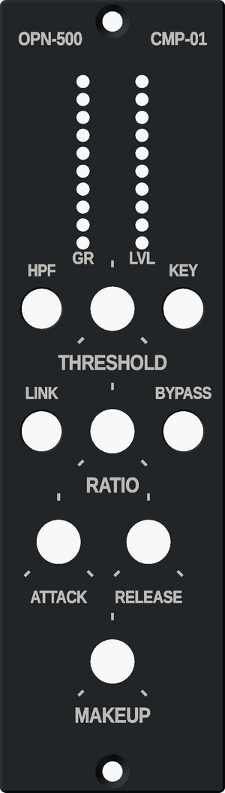

# 3D-printed faceplate

A faceplate you can print on an ordinary FDM printer, for anyone without a laser cutter,
CNC or panel shop. Same holes and legends as the `toggle` layout in [`../`](../README.md),
so it fits the front board as drawn.

| File | What it is |
|---|---|
| `faceplate.stl` | The faceplate, already flipped face down for printing. |
| `faceplate-legend.stl` | The engraved legend and pot ticks as their own body, for a second colour. |
| `faceplate-fit-test.stl` | A 27 mm strip across THRESHOLD, HPF, KEY and the bottom of both meters. |
| `faceplate-fit-legend.stl` | The fit test's legend. |
| `faceplate.scad` | The model. Every print setting is a parameter at the top. |
| `panel_data.scad` | Hole positions and legend text, written by `make_panel.py`. Don't edit it. |
| `build.sh` | Re-runs `make_panel.py` and exports all four STLs (a few minutes). |

## What's different from the metal panel

- **Thickness:** 3.2 mm, the same as the 1/8″ metal panel, so the rack screws and everything
  behind the panel sit exactly where the front board expects. The back is flat.
- **Pot wells:** each pot hole has a 12.5 mm counterbore on the front, 1.2 mm deep. That leaves
  2.0 mm of plastic under the nut, which gives the 9 mm pots' short bushing about 3 mm of
  thread for the washer and nut (the metal panel needed thinning here for the same reason).
  The 11 mm knobs sit over the wells.
- **Fit allowance:** pot, toggle and screw holes print 0.2 mm larger than drawn
  (`hole_comp`), because FDM holes come out undersize. The meter holes stay 2.2 mm: the LEDs
  sit behind the panel, so those holes only let the light out, and keeping them small keeps
  0.8 mm of plastic between neighbours.
- **Width and height:** 37.8 × 132.6 mm rather than the nominal 38.10 × 133.35, so it slides in
  beside the next module. The front edge has a 0.4 mm chamfer so first-layer squish doesn't
  flare it.
- **Legend:** engraved 0.4 mm into the front, 30% larger than on the mockup (the mockup's
  1.4 to 1.7 mm capitals are too fine for a 0.4 mm nozzle). Each pot gets three ticks: start,
  middle and end of travel.

## Printing it

1. **Print the fit test first.** It's a short print. Check that a pot and a toggle drop
   through their holes, the pot nut sits inside its well, and the LEDs line up behind the
   meter holes. If a hole is tight or loose, change `hole_comp` in `faceplate.scad` and run
   `./build.sh` (or open the file in OpenSCAD and use the Customizer).
2. **Material:** PETG in black or dark grey. A light colour lets each meter LED glow through
   the thin walls on either side of its hole. PETG over PLA because a rack runs warm and
   PLA slowly gives way under a tightened nut.
3. **Settings:** 0.4 mm nozzle, 0.2 mm layers, 4 walls, 100% infill, no supports. Print it as
   exported, face down. A textured PEI sheet gives the front a nice finish.
4. **Two colours (optional):** import `faceplate.stl` and `faceplate-legend.stl` together as
   one object with two parts (Bambu Studio and OrcaSlicer ask when you import both;
   in PrusaSlicer right-click the panel, Add part, Load). They share coordinates, so they line
   up. Give the legend a light filament; only the first two layers change colour.
   With one colour, fill the engraving afterwards with paint or a white wax crayon rubbed
   in and wiped off.

## Fitting it

- Snap the small anti-rotation tab off the front of each pot, as you would for a metal
  panel, or it holds the pot off the back of the panel.
- Tighten the nuts gently. Plastic creeps, and the nuts only need to hold the board.
- A plastic panel doesn't ground the pot and toggle bushings the way an anodised panel tied
  to CHASSIS does. If touching a knob adds hum, run a wire from a solder tag under one toggle's
  nut to the main board's CHASSIS (H2).
